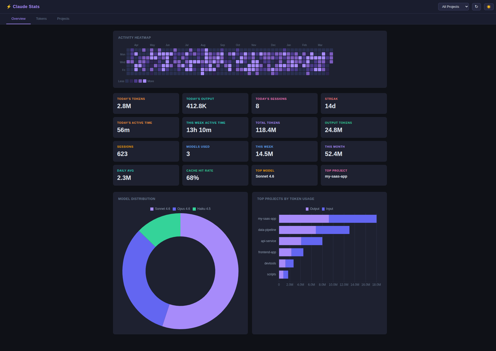
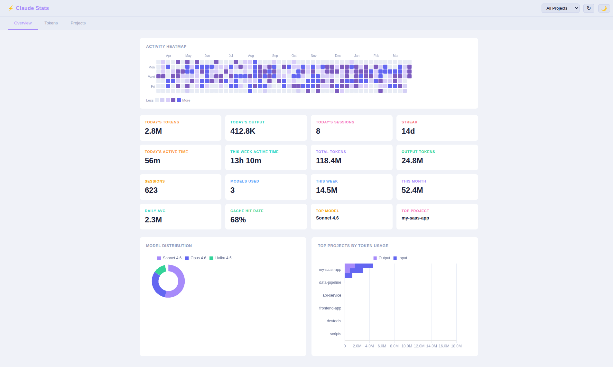
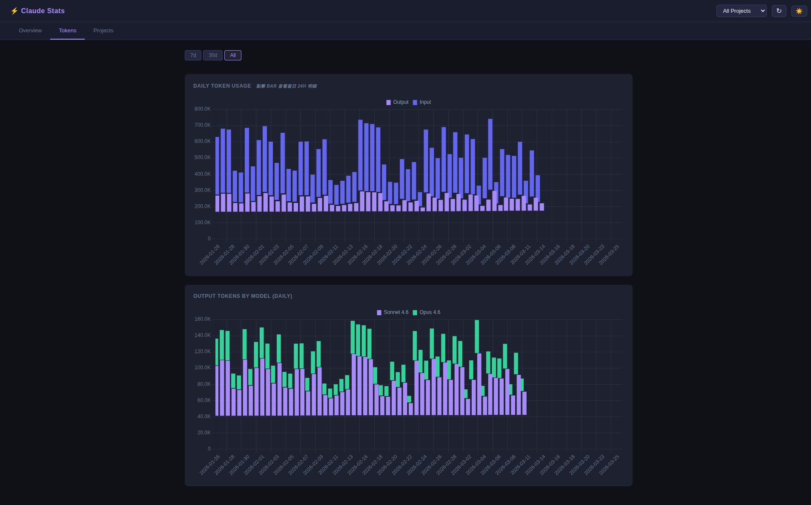

# Claude Stats

[繁體中文](./README.zh-TW.md)

A local web dashboard to visualize your [Claude Code](https://claude.ai/code) usage — token consumption, active time, model distribution, and per-project breakdown.

Reads data directly from `~/.claude/projects/` with no setup required beyond Docker (or Python).






## Features

**Overview**
- **Activity Heatmap** — GitHub-style 53-week calendar; click any cell to drill into that day's detail
- **16 KPI cards** — today's tokens / output / sessions / active time, this week's active time, streak, totals, this week/month, daily avg, cache hit rate, top model, top project
- **Model Distribution** — donut chart of token usage by model
- **Top Projects** — horizontal bar chart with output vs input breakdown
- **Home shortcut** — click `Claude Stats` in the top-left to return to the overview and exit drilldowns

**Tokens Tab**
- **Daily stacked bar chart** — input + output per day (cache merged into input), click any bar to drill into 15-minute granularity
- **Output by Model** — daily stacked bar by model
- **24H drilldown** — 15-minute resolution bar chart with per-day KPIs (total, output, input, sessions, active time, models used, top model, top project)
- **15-minute slot drilldown** — click any bar in the 24H chart to inspect that slot's projects, models, sessions, and active time
- **High-resolution export** — download the daily 24H drilldown as a print-ready PNG
- 7d / 30d / All time range filter

**Projects Tab**
- All projects ranked by token usage
- 1D / 7D / 30D / ALL time range filter

**General**
- **Active time tracking** — measures actual Claude execution time by unioning request intervals across parallel agents (no double-counting)
- **File-aware caching** — parsed usage records are cached and automatically invalidated when local or imported source files change
- **Project filter** — nav dropdown to scope all charts to a single project
- **Automatic timezone** — all timestamps converted to your browser's local timezone
- **Export / Import** — export or import Claude raw data with project and day-range filters, then aggregate multi-machine usage in one dashboard
- **Import preview** — inspect the projects inside an import zip before choosing which project and day range to merge
- **Report export** — download weekly or monthly HTML reports for the current project scope
- **Dark / Light mode** — toggle via ☀️/🌙 button, saved in `localStorage`
- **Auto-refresh** — data refreshes every 5 minutes; manual refresh button in nav



## Quick Start (Docker)

```bash
git clone https://github.com/littlehsun/claude-stats
cd claude-stats
./run.sh
```

The interactive menu lets you:

```
╔══════════════════════════════════╗
║        Claude Stats Runner       ║
╚══════════════════════════════════╝

  1) Start (default port 5050)
  2) Start on custom port
  3) Stop
  4) Rebuild & Start
  5) Exit
```

Press **Enter** to start on the default port 5050, then open **http://localhost:5050**.

> **Requirements:** [Docker](https://docs.docker.com/get-docker/) with the daemon running.

## Manual Setup (Python)

```bash
git clone https://github.com/littlehsun/claude-stats
cd claude-stats

python3 -m venv venv
source venv/bin/activate
pip install -r requirements.txt
./start.sh
```

## Data Source

All data is read locally from `~/.claude/projects/`. Each subdirectory is a project, each `.jsonl` file is a conversation. The app does a two-pass parse per file — first to build a `uuid → timestamp` map, then to extract token usage and compute per-request active time intervals.

To aggregate usage from multiple computers, click `Export` on one machine and `Import` that zip on another. Both export and import support filtering by project and recent day range. Import first previews the zip so you can choose a specific project to merge. Imported data is merged into a single local store during import, and duplicate assistant events are discarded immediately by message identity so only one copy is retained on disk.

| Field | Source |
|-------|--------|
| `input_tokens` | `message.usage.input_tokens` |
| `output_tokens` | `message.usage.output_tokens` |
| `cache_read` | `message.usage.cache_read_input_tokens` |
| `cache_create` | `message.usage.cache_creation_input_tokens` |
| request duration | `assistant.timestamp − parent_user.timestamp` |

No data leaves your machine.

## Timezone

Timestamps in the raw data are stored in UTC. The dashboard automatically detects your browser's local timezone and converts all dates and hours accordingly — daily charts, the heatmap, hourly drilldowns, and today's stats all reflect your local time. No configuration is required.
